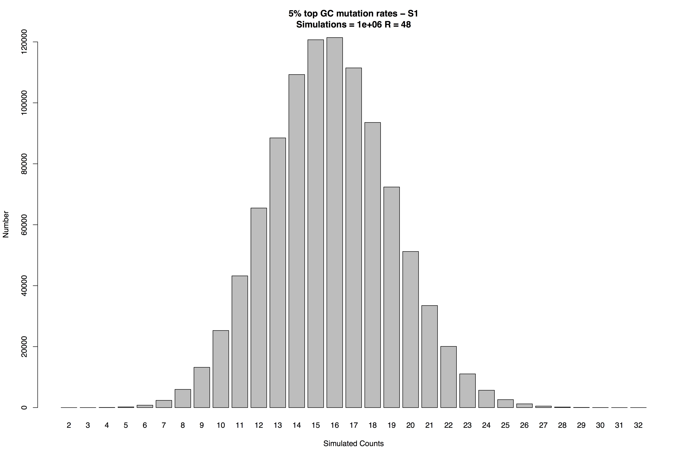

# monte

The [R](https://www.r-project.org) script **monte** is a representative example of the code used to determine the statistical significance of high or low mutation rates at specific nucleotide states (here, the **C** at G**C** sites) in an experimental system with DNA subjected to different temperatures and pressures for variable lengths of time.

**monte** reads a list of observed mutation rates, determines target and flanking sites in the DNA sequence, and applies Monte Carlo permutation to calculate whether the mutation rates at these sites are higher or lower than expected.

This particular code example reports the test for:

| parameter           | value                 |
|--------------------:|:----------------------|
| target              | **C**                 |
| flanking            | (G)**C**              |
| mutation rate range | top 5%                |
| test                | higher than expected? |

For this example, **monte** produces a plot showing the distribution of top 5% mutation rates at (G)**C** sites in 106 permutations:

The probability is then reported as the number of simulated counts that are greater than or equal to the number of sites observed in the real data (here, R = 48).  Hence, in this example, *P* ≤ 10-6.

Author: [Jasmin Franke](mailto:&#106;&#102;&#49;&#51;&#50;&#53;&#49;&#53;&#64;&#117;&#110;&#105;-&#103;&#114;&#101;&#105;&#102;&#115;&#119;&#97;&#108;&#100;&#46;&#100;&#101;) 
Maintainer: [Murray Cox](https://www.genomicus.com)
